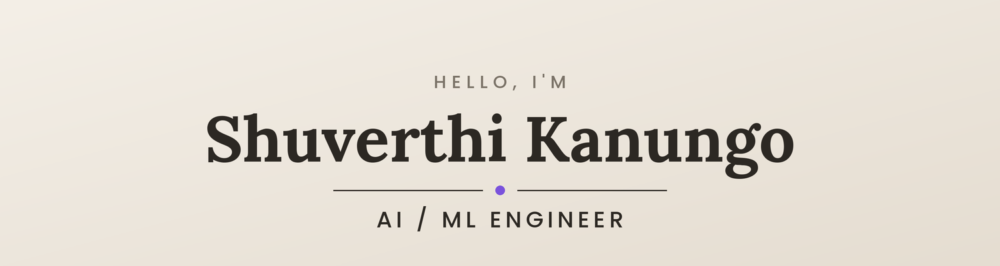
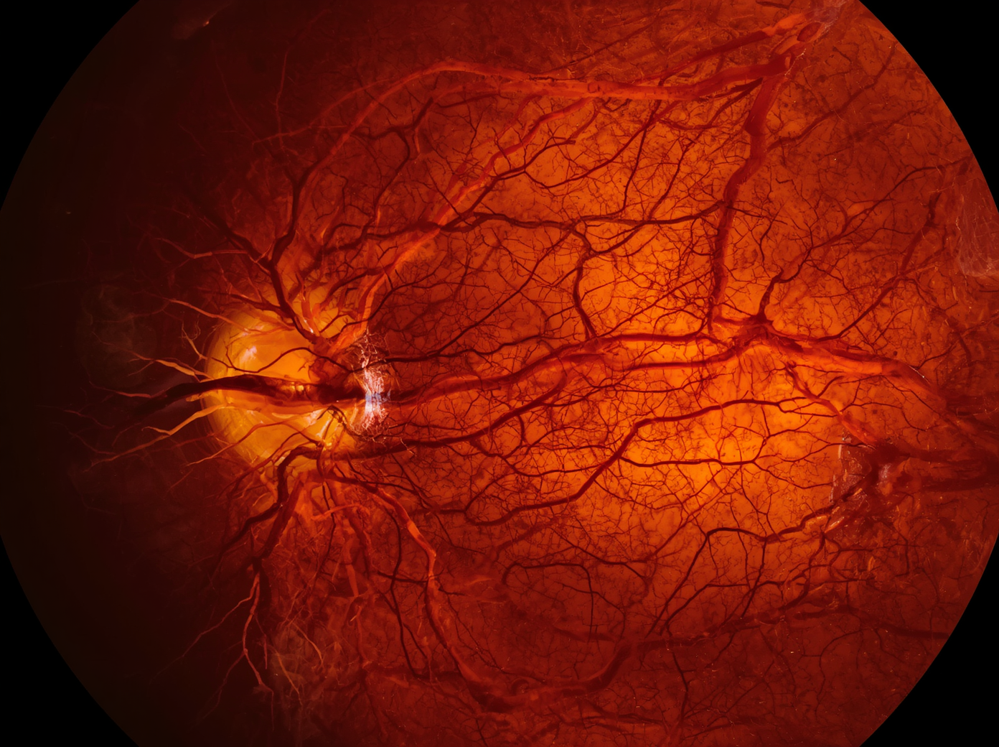

<!--
════════════════════════════════════════════════════════════════
  SETUP — upload these image files to your repo root, next to
  this README, so everything renders:
    • banner.png
    • icon-linkedin.png
    • icon-email.png
    • proj-retinopathy.png
    • proj-explainable.png
    • proj-sentiment.png
  (This README goes in a repo named exactly your username: shuvgits)
════════════════════════════════════════════════════════════════
-->

<!-- ===================== HEADER ===================== -->

  <b>M.S. Computer Science (AI) · Hofstra University</b> · New York

---

## About Me

I design and deploy production-grade AI systems — LLM-powered applications, RAG pipelines, agentic workflows, and machine learning models built to solve real-world problems. My work centers on the intersection of **NLP, agentic AI, and responsible AI design**, with a consistent focus on systems that are rigorous, reliable, and genuinely useful.

- 🔭 &nbsp;Currently developing **LLM-powered applications, RAG pipelines, and agentic workflows**
- 👁️ &nbsp;Recently delivered a deep learning system for **diabetic retinopathy detection, achieving 90%+ accuracy**
- 🌱 &nbsp;Advancing my work in **responsible AI, model evaluation, and fairness-aware fine-tuning**
- 💬 &nbsp;Areas of focus: **LLMs, RAG, GPT fine-tuning, bias mitigation, and ETL for ML**
- 🧪 &nbsp;Model explainability: **GradCAM · Integrated Gradients · Feature-Map Attention**

---

## Tech Stack

**Languages**

**ML / AI**

**Web & Data**

---

## Featured Work

<table>
<tr>
<td width="33%" align="center">

  
Diabetic Retinopathy Detection from Fundus Images using Image Processing.
  

 
<a href="https://github.com/shuvgits/-Diabetic-Retinopathy-Detection-from-Fundus-Images-Using-Image-Processing"><b>View Project →</b></a>
</td>
<td width="33%" align="center">

  
<b>Seeing through the Black Box:</b> Explainable AI for Diabetic Retinopathy Detection.
  

 
<a href="https://github.com/shuvgits/Seeing-Through-the-Black-Box-Explainable-AI-for-Diabetic-Retinopathy-Detection"><b>View Project →</b></a>
</td>
<td width="33%" align="center">

  
NLP pipeline that classifies <b>public sentiment</b> toward figures across social media.
  

 
<a href="https://github.com/shuvgits/Celebrity-Sentiment-Analysis-in-Social-Media-Using-Natural-Language-Processing"><b>View Project →</b></a>
</td>
</tr>
</table>

---

## Experience Snapshot

<table>
<tr>
<td align="center">🗓️ <b>2025</b></td>
<td><b>Associate SW Developer (Co-Op)</b> Hotwire Communications</td>
<td>Shipped LLM solutions that cut manual data processing &nbsp;</td>
</tr>
<tr>
<td align="center">🗓️ <b>2025</b></td>
<td><b>Software Engineer Intern</b> SpringBoard Incubators</td>
<td>ML-powered chatbot features &nbsp;</td>
</tr>
<tr>
<td align="center">🗓️ <b>2024</b></td>
<td><b>Graduate Research Assistantship</b> Hofstra University</td>
<td>Fine-tuned GPT models for fairness &nbsp;</td>
</tr>
</table>

---

### 🎓 Certified in Generative AI with LLMs · Exploratory Data Analysis for ML

*"I don't just train models — I make them useful, fair, and production-ready."*

⭐️ Thanks for stopping by — let's build something responsible and clever together.

