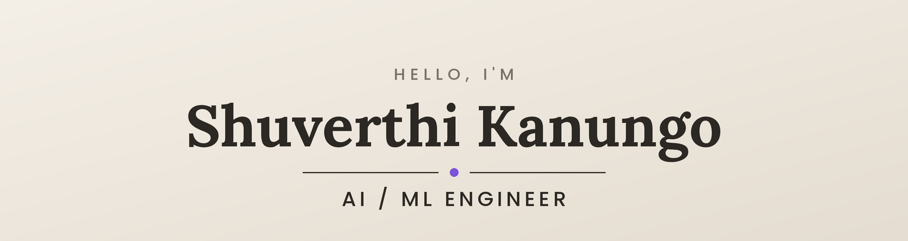
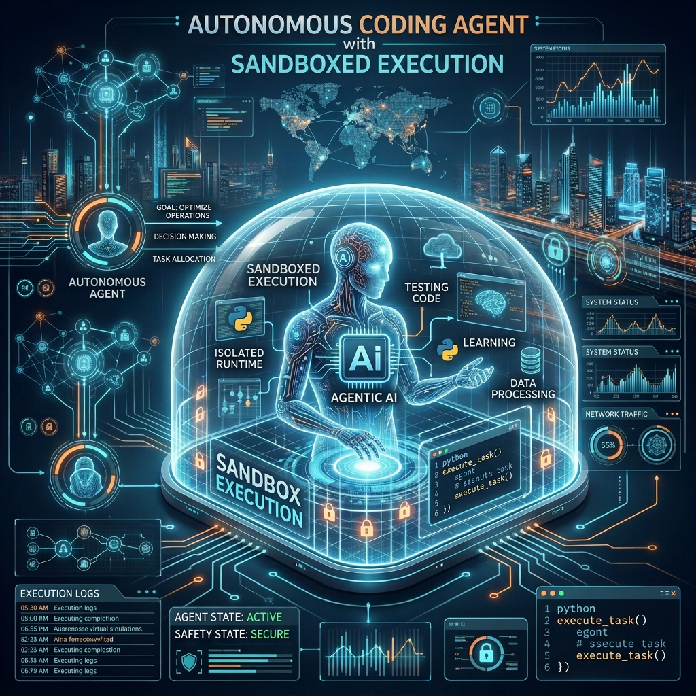
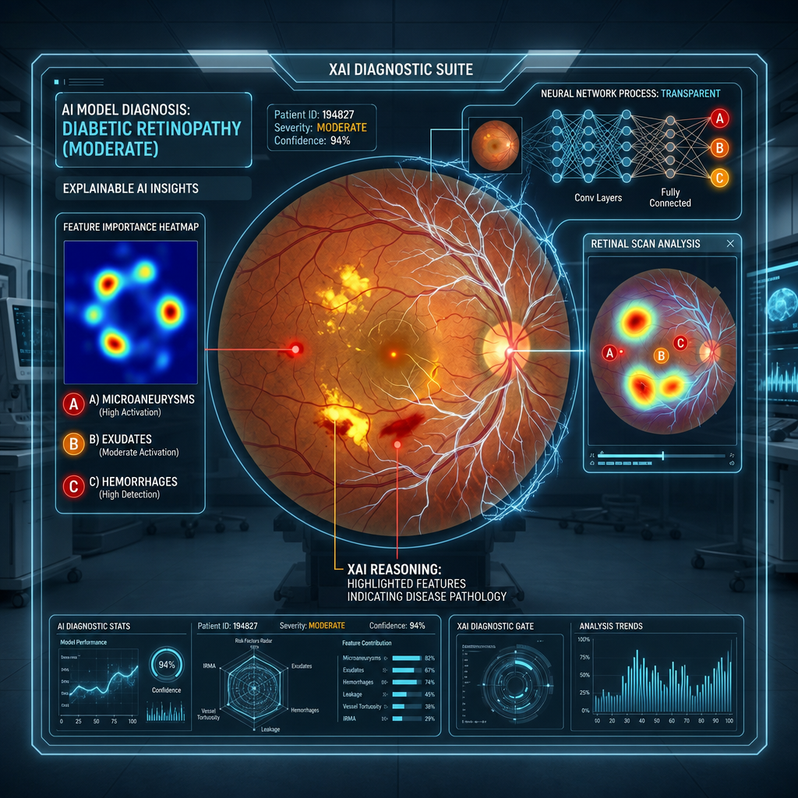
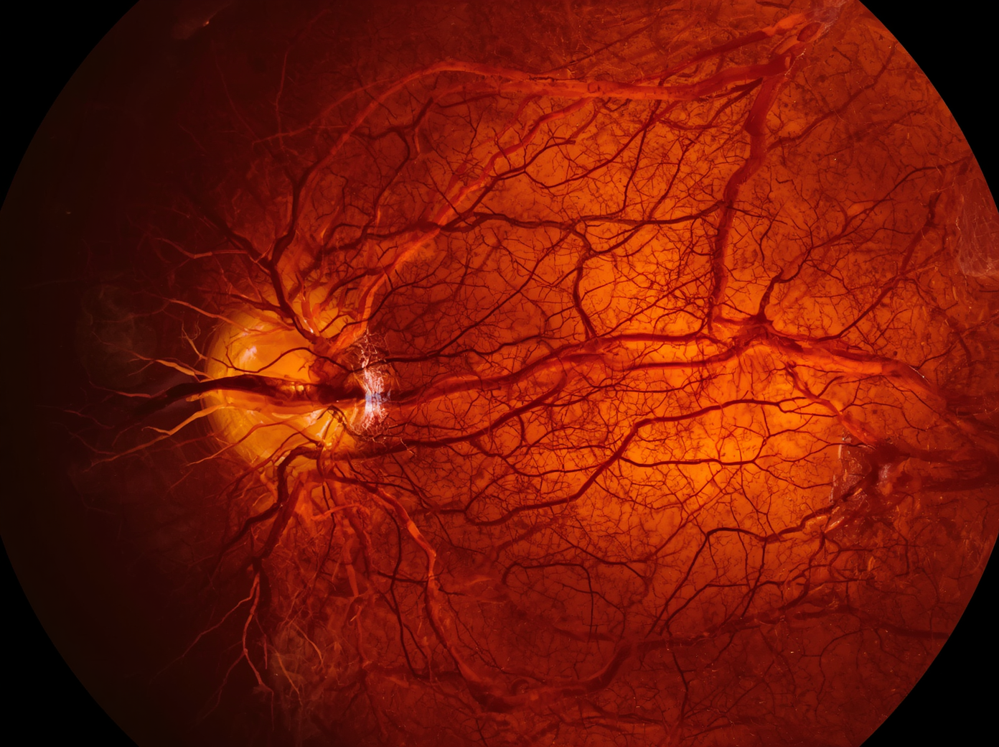

<!--
════════════════════════════════════════════════════════════════
  SETUP
  Repo name must be exactly: shuvgits

  Upload these images to the repo root, all resized to the SAME
  dimensions (800 x 450 px recommended):
    • banner.png
    • icon-linkedin.png   (square, ~46px)
    • icon-email.png      (square, ~46px)
    • proj-agent.png
    • proj-explainable.png
    • proj-sentiment.png
    • proj-retinopathy.png

  NOTE: GitHub strips JavaScript and CSS animation from READMEs,
  so carousels/auto-scroll are not possible. If you want motion,
  record a screen capture and embed it as an animated GIF.
════════════════════════════════════════════════════════════════
-->

<h3>Welcome to my corner of GitHub 👋</h3>

&nbsp;

---

## About Me

I design and deploy production-grade AI systems — LLM-powered applications, RAG pipelines, agentic workflows, and machine learning models built to solve real-world problems. My work centers on the intersection of **NLP, agentic AI, and responsible AI design**, with a consistent focus on systems that are rigorous, reliable, and genuinely useful.

- 🔭 &nbsp;Currently building **LLM-powered applications, RAG pipelines, and agentic workflows**
- 🤖 &nbsp;Recently shipped an **autonomous coding agent** that writes tests, runs them sandboxed, and repairs itself
- 👁️ &nbsp;Built a clinical deep learning system reaching **0.96 AUC on proliferative diabetic retinopathy**
- 🌱 &nbsp;Advancing my work in **model evaluation, explainability, and fairness-aware fine-tuning**
- 🧪 &nbsp;Explainability toolkit: **Grad-CAM · Integrated Gradients · SHAP · Feature-Map Attention**

---

## Tech Stack

**Languages**

**AI / ML**

**Infrastructure & Web**

---

## Featured Work

<table>
<tr>
<td width="50%" valign="top" align="center">

<b>Autonomous Coding Agent with Sandboxed Execution</b>

Writes pytest suites, runs them in a hardened Docker sandbox, reads the real execution failure, and repairs itself. <b>95.3% mean coverage</b> across 7 third-party modules at <b>$0.08 each</b>, with half the successful runs recovering from a failing first attempt.

<a href="https://github.com/shuvgits/autonomous-test-agent"><b>View Project →</b></a>

</td>
<td width="50%" valign="top" align="center">

<b>Seeing Through the Black Box</b>

EfficientNet-B4 grading diabetic retinopathy across <b>35,126</b> fundus images, paired with four explainability methods. <b>0.96 AUC</b> on proliferative DR, with attribution analysis that surfaced a border-artifact failure mode.

<a href="https://github.com/shuvgits/Seeing-Through-the-Black-Box-Explainable-AI-for-Diabetic-Retinopathy-Detection"><b>View Project →</b></a>

</td>
</tr>
<tr>
<td width="50%" valign="top" align="center">

<b>Sentiment Analysis at Scale</b>

End-to-end NLP pipeline over <b>2M+</b> social media documents, fine-tuning a BERT classifier to <b>94% precision</b> on multi-class sentiment classification.

<a href="https://github.com/shuvgits/Celebrity-Sentiment-Analysis-in-Social-Media-Using-Natural-Language-Processing"><b>View Project →</b></a>

</td>
<td width="50%" valign="top" align="center">

<b>Diabetic Retinopathy Detection</b>

CNN with transfer learning over <b>10,000+</b> fundus images, with evaluation tuned to reduce false negatives in a clinical screening context.

<a href="https://github.com/shuvgits/Diabetic-Retinopathy-Detection-from-Fundus-Images-Using-Image-Processing"><b>View Project →</b></a>

</td>
</tr>
</table>

---

## Experience Snapshot

<table>
<tr>
<td align="center">🗓️ <b>2025</b></td>
<td><b>Associate Software Developer (Co-Op)</b> Hotwire Communications</td>
<td>Shipped production LLM systems that cut manual processing &nbsp;</td>
</tr>
<tr>
<td align="center">🗓️ <b>2025</b></td>
<td><b>Software Engineer Intern</b> SpringBoard Incubators</td>
<td>LLM-powered chatbot features &nbsp;</td>
</tr>
<tr>
<td align="center">🗓️ <b>2024</b></td>
<td><b>Graduate Research Assistant</b> Hofstra University</td>
<td>Fine-tuned GPT models for fairness &nbsp;</td>
</tr>
</table>

---

**Open to AI Engineer and ML Engineer roles**

[LinkedIn](https://www.linkedin.com/in/shuverthikanungo) &nbsp;·&nbsp; [Email](mailto:shuverthikanungo.co@gmail.com)

